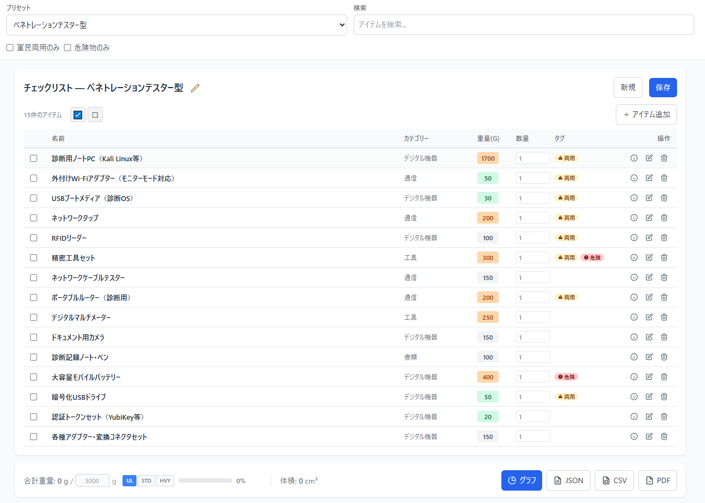

<!--
---
id: day098
slug: ops-loadout

title: "OpsLoadout"

subtitle_ja: "緊急脱出キットのチェックリストツール"
subtitle_en: "Operations Packing Checklist Tool"

description_ja: "任務に特化した装備構成（Loadout）を計画・編集・監査・エクスポートするためのツール。軍民両用フラグ、危険物フラグ、出典リンク、国別の法的注意を管理可能。SERE訓練、大使館脱出、災害対策、ペンテスター装備など18種類のプリセットを収録。"
description_en: "Interactive tool for designing, auditing, and exporting mission-focused pack and kit loadouts. Define, edit, and visualize custom equipment configurations with dual-use/hazard flags, source citations, and country-specific legality notes. Includes 18 presets for SERE, embassy evacuation, disaster preparedness, pentester gear, and more."

category_ja:
  - 物理的セキュリティ
  - サイバー忍術
  - スパイ
  - プレッパー
category_en:
  - Physical Security
  - Cyber Ninjutsu
  - Spy
  - Prepper

difficulty: 3

tags:
  - ops
  - loadout
  - kit-management
  - inventory
  - tactical
  - fieldcraft
  - packlist
  - javascript
  - sere
  - edc
  - disaster-preparedness

repo_url: "https://github.com/ipusiron/ops-loadout"
demo_url: "https://ipusiron.github.io/ops-loadout/"

hub: true
---
-->

# OpsLoadout - 緊急脱出キットのチェックリストツール


[](https://ipusiron.github.io/ops-loadout/)

**Day098 - 生成AIで作るセキュリティツール100**

**OpsLoadout** は、任務（Operations）に特化した装備構成（Loadout）を計画・編集・監査・エクスポートするためのツールです。

軍・法執行機関、SERE教育、組織内の備蓄／準備運用など、業務・訓練目的での利用を想定しています。
現場での即応性や再現性のあるパッキング、そして誰が何をいつ準備したかを記録する台帳的な履歴管理を主眼としており、主に「何を持つか／何をチェックするか」を管理することを目的とします。

各アイテムにはdual_use（軍民両用）やhazard_flag（危険物）フラグ、出典リンク、国別の法的注意（legality_notes）を紐づけて管理できる仕組みを備えています。
これにより、安全配慮やコンプライアンス表示を組み込みつつ、組織や現地法に沿った運用を支援します。

---

## 🌐 デモページ

👉 **[https://ipusiron.github.io/ops-loadout/](https://ipusiron.github.io/ops-loadout/)**

ブラウザーで直接お試しいただけます。

---

## 📸 スクリーンショット

>
>*ペネトレーションテスターの装備品*

---

## 🎯 主要な設計方針（Design principles）
- **事実ベース**：公開資料／展示記録／FOIA資料などの実例を出典として参照し、アイテムの有無や用途を記載します。   
- **教育・業務用途限定**：ツールは教育・準備・装備監査を目的とし、危険な手順や違法行為の実行手順は表示しません。  
- **法的配慮**：`dual_use`（軍民両用）や `hazard_flag`（危険物/規制対象）の項目には明確な注意表示と国別の一般的注意文を添付します。
- **透明性**：各アイテムには必ず「出典（source）」を紐づけ、参照元を示します。

---

## 👥 対象ユーザー（Target Users）

本ツールは、以下のような個人・組織での活用を想定しています：

### 企業・組織向け
- **安全管理部門・BCM担当者**：海外拠点の駐在員向け緊急脱出キット標準化、装備監査
- **警備会社・セキュリティ部門**：警備員装備の標準化、警備業法遵守、定期点検管理
- **消防署・救助隊**：消防隊員・救助隊員の携行装備管理、訓練用チェックリスト
- **IT企業・セキュリティチーム**：ペンテスター、ネットワークエンジニア、フォレンジック調査員の業務用装備管理
- **山岳救助隊・SAR（捜索救助）チーム**：救助活動時の装備チェック、ミッション別パッキングリスト
- **SERE訓練施設・教育機関**：サバイバル訓練カリキュラム、装備教材作成
- **防災担当者（自治体・企業）**：職員向け防災キット配布、避難訓練資料

### 個人・家族向け
- **防災意識の高い個人・家族**：地震・台風等の災害に備えた緊急避難キット準備
- **複数拠点を持つリモートワーカー**：自宅・実家・シェアオフィス等の各拠点に脱出キット配置
- **海外赴任者・海外旅行者**：現地での緊急事態に備えたGo Bag（持ち出し袋）準備
- **アウトドア愛好家・登山者**：日帰り登山・長期トレッキングの装備チェックリスト
- **プレッパー（長期備蓄実践者）**：自給自足的な長期サバイバル装備の体系的管理

### 専門職・技術者向け
- **デジタルノマド・IT技術者**：海外移動時の業務継続用装備（PC、通信機器、電源関連）
- **ロックスミス（鍵師）**：業務用工具の在庫管理、出張時の携行品チェック
- **ハードウェア開発者（IoT/組み込み）**：現場デバッグ用の測定機器・工具セット管理
- **システム管理者（SysAdmin）**：データセンター・サーバールーム保守時の工具キット
- **無線通信技術者**：電波法遵守を意識した無線機器・測定器具の携行管理

---

## ✨ 主な機能

### 1. プリセット管理
- **ビルトインプリセット**：18種類のシナリオ別プリセット
  - 脱出・回避系：大使館脱出、SERE
  - 日常携行系：都市個人型
  - 救助・消防系：消防隊携行型、SAR（捜索救助）
  - 警備・防犯系：警備員携行型、鍵師型
  - 災害対応系：災害避難型、プレッパー（長期備蓄）型
  - ハッカー・IT系：デジタルノマド型、ペンテスター型、ネットワークエンジニア型、デジタルフォレンジック調査員型、ハードウェア開発者型、SysAdmin型、データリカバリー専門家型、無線通信技術者型
- **カスタムプリセット**：自分で作成したチェックリストをプリセットとして保存・再利用可能（localStorage）
  - ✏️ **名前変更機能**：カスタムプリセット選択時に名前変更ボタンでプリセット名を編集可能
  - 🗑️ **削除機能**：不要なカスタムプリセットの削除
- **カテゴリフィルター**：脱出/日常/救助/警備/災害/ITの6カテゴリでプリセットを絞り込み

### 2. チェックリスト管理
- **複数チェックリスト保存**：保存済みチェックリスト一覧から読み込み・削除
- **上書き/別名保存**：既存チェックリスト編集時に上書きor別名保存を選択可能
- **アイテム操作**：追加・編集・削除、詳細情報の表示
- **検索・フィルター**：アイテム名検索、軍民両用のみ/危険物のみのフィルター

### 3. パッキング機能
- **数量管理**：アイテムごとの数量をインライン編集
- **推奨数量**：recommended_quantityによる充足度確認
- **入替頻度**：daily / weekly / monthly / never の設定
- **チェックボックス**：パック済みアイテムのチェック管理
- **自動計算**：チェック済みアイテムの合計重量・体積を数量考慮で計算

### 4. アイテム詳細
- 出典（sources）、法的注意（legality_notes）
- 推奨保管箇所、重量・体積、カテゴリータグ
- 軍民両用フラグ、危険物フラグの警告表示

### 5. エクスポート機能
- **PDF**：日本語対応（html2canvas使用）、チェックボックス状態を表示、タグ表示
- **CSV**：スプレッドシート互換形式
- **JSON**：完全なデータ構造を保持

---

## 💡 活用シナリオ（Use Cases）

本ツールは、個人から組織まで幅広い場面で活用できます。以下に3つの具体的なシナリオを紹介します。

### シナリオ1：海外駐在員の緊急脱出準備（企業・組織向け）

**登場人物**: 田中さん（外資系企業の安全管理部門・海外拠点担当）

**状況**:
- 中東地域に10名の駐在員を派遣
- 政情不安により緊急退避（NEO: Noncombatant Evacuation Operation）の可能性
- 各駐在員に標準化された脱出キットを配布する必要がある

**OpsLoadoutの活用フロー**:

1. **初期準備（Day 1-3）**:
   - 「Embassy-Escape型」プリセットをベースに読み込み
   - 現地事情に合わせてカスタマイズ：
     - 現地通貨（米ドル+現地通貨）を追加
     - 大使館連絡先リストを更新
     - 現地SIMカードと充電器を追加
   - **「⭐ プリセット化」にチェック** → 「中東駐在員標準キット」として保存

2. **配布・監査（Week 1-2）**:
   - カスタムプリセットをPDFエクスポート → 駐在員10名に配布
   - 各駐在員が自宅・オフィス・ホテルの3箇所に同じキットを配置
   - 月次の装備監査：PDF印刷版を持って実際にチェック

3. **定期更新（Quarterly）**:
   - 四半期ごとにプリセットを見直し：
     - モバイルバッテリーの充電確認
     - 現金の有効期限（紙幣デザイン変更）
     - 緊急連絡先の更新
   - 変更内容を「✏️ 名前変更」で「中東駐在員標準キット v2.1」にバージョン管理

4. **緊急時対応**:
   - 政情悪化 → 全駐在員に「キットを持って大使館へ」と指示
   - 事前に配布したPDFチェックリストで持ち物確認
   - 帰国後、JSONエクスポートで装備使用状況を記録・次回改善に活用

**効果**:
- ✅ 標準化された装備で全員の安全確保
- ✅ PDF/CSV出力で監査証跡を保持
- ✅ カスタムプリセットで組織知の蓄積

---

### シナリオ2：警備会社の装備監査（組織向け）

**登場人物**: 佐藤さん（警備会社の装備管理責任者）

**状況**:
- 50名の警備員が各現場（オフィスビル・商業施設・イベント会場）で勤務
- 警備業法に基づく装備基準の遵守が必要
- 装備の紛失・不足を防ぎ、定期点検を実施したい

**OpsLoadoutの活用フロー**:

1. **標準装備の定義（Month 1）**:
   - 「Security Guard型」プリセットを読み込み
   - 自社の装備基準に合わせて編集：
     - 業務用無線機（型番指定）
     - 警備用懐中電灯（型番指定）
     - 警棒（所持許可証番号記録欄を追加）
   - **「⭐ プリセット化」** → 「A社標準警備装備v1.0」として保存

2. **現場別カスタマイズ**:
   - オフィスビル警備: A社標準 + 「鍵管理簿」
   - イベント警備: A社標準 + 「拡声器」「救急セット（大型）」
   - 夜間警備: A社標準 + 「予備バッテリー×2」
   - それぞれをカスタムプリセットとして保存

3. **定期監査（Monthly）**:
   - 月初に各現場責任者にPDF配布
   - 警備員が実際に装備をチェック
   - 不足品をCSVエクスポート → 発注リストとして購買部に提出

4. **新人研修**:
   - 新人警備員に「A社標準警備装備v1.0」のPDFを配布
   - OpsLoadoutの画面を見せながら各装備の目的・使用方法を説明
   - 研修後、実際にチェックリストを使って装備確認の実地訓練

**効果**:
- ✅ 装備基準の統一と法令遵守
- ✅ CSVエクスポートで発注業務の効率化
- ✅ 新人教育資料として活用

---

### シナリオ3：在宅勤務者の複数拠点防災準備（個人・家族向け）

**登場人物**: 鈴木さん（IT企業勤務・在宅勤務中心・家族3人）

**状況**:
- 自宅（東京）、実家（静岡）、シェアオフィス（渋谷）の3拠点を行き来
- 首都直下地震への備えとして、各拠点に脱出キットを配置したい
- 家族（配偶者、小学生の子供1人）も含めた準備が必要

**OpsLoadoutの活用フロー**:

1. **拠点別キットの作成（Week 1）**:

   **自宅用キット**（「Urban-Personal型」ベース）:
   - 大人用×2（自分+配偶者）
   - 子供用×1（小学生向けに軽量化）
   - ペット用×1（猫用のフードと折りたたみ皿）
   - **「⭐ プリセット化」** → 「鈴木家・自宅用」として保存

   **車載キット**（「Embassy-Escape型」ベース）:
   - 帰宅困難時を想定
   - 工具セット、発煙筒、ブランケット追加
   - **「⭐ プリセット化」** → 「鈴木家・車載用」

   **実家用キット**（「Disaster型」ベース）:
   - 高齢の両親向けに医薬品を多めに
   - 常備薬リスト、かかりつけ医の連絡先を追加
   - **「⭐ プリセット化」** → 「鈴木家・実家用」

2. **初回調達（Week 2-3）**:
   - 3つのプリセットをCSVエクスポート
   - スプレッドシートで統合 → 重複アイテムをまとめて購入
   - Amazonで一括注文（合計予算: 約5万円）

3. **物理的配置（Week 4）**:
   - 自宅: 玄関の専用バッグに全員分を収納
   - 車: トランクの専用ボックスに収納
   - 実家: 帰省時に持参して両親に説明・配置

4. **定期メンテナンス**:
   - **3ヶ月ごと**（季節の変わり目）:
     - モバイルバッテリーの充電確認
     - 夏→冬: カイロ追加、冷却シート削除
   - **半年ごと**:
     - 全キットを実際に持ち出し訓練
     - OpsLoadoutのチェックリストをPDF印刷して家族で確認
   - **年1回**:
     - 装備の見直し: 新製品への更新検討
     - カスタムプリセットの名前を「ミジンコ家・自宅用 v2024」に変更

5. **緊急時の活用**:
   - 地震発生 → 自宅が危険と判断
   - 玄関のバッグを持って避難所へ
   - 避難所でスマホの充電が切れる → OpsLoadoutのPDFをオフライン保存しておいたので確認可能

**効果**:
- ✅ 3拠点それぞれに最適化された装備配置
- ✅ CSV統合で予算管理・重複購入の防止
- ✅ 家族全員が装備内容を理解・共有

---

## 📦 典型プリセット（Example presets）

### 脱出・回避系（Evasion/Escape）
- **Embassy-Escape（大使館脱出型）**
  緊急現金・携帯水浄化・LED／ライトスティック・ミニファーストエイド・予備SIM 等。
  出典：外務省／米国務省の大使館非常計画や GAO 報告に基づく EAP の必須要素を参照。

- **SERE-Aircrew（SERE航空兵型）**
  サバイバルブランケット、信号ミラー、携帯浄水タブレット、コンパス、防水マッチ等。
  出典：米空軍 SERE ハンドブック（AF Handbook 10-644）。

### 日常携行系（EDC/Personal）
- **Urban-Personal（都市個人型）**
  少額緊急現金、モバイルバッテリー、小型包帯セット、折りたたみ水筒、マスク等。
  現実的かつ法令順守に配慮した日常携行セット。

### 救助・消防系（Rescue/Fire）
- **Firefighter（消防隊携行型）**
  業務用無線機、防爆ライト、耐熱手袋、消防斧、救助ロープ、携帯水筒等。
  出典：消防装備基準、消防技術基準。

- **SAR（捜索救助型）**
  GPS端末、業務用無線機、大型救急セット、折りたたみ担架、ザイル・カラビナセット等。
  出典：山岳救助マニュアル、救助活動基準。

### 警備・防犯系（Security）
- **Security Guard（警備員携行型）**
  業務用無線機、警備用懐中電灯、警棒、警笛、巡回記録帳、救急セット等。
  出典：警備業法、警備実務マニュアル。

- **Locksmith（鍵師型）**
  業務用工具セット、特殊開錠用具（業務用途のみ）、鍵複製機材、ピンニングキット等。
  出典：特殊開錠用具所持禁止法、鍵師業務マニュアル。

### 災害対応系（Disaster）
- **Disaster（災害避難型・1人分・1日）**
  飲料水（2L）、非常食（アルファ米3食）、懐中電灯、ラジオ、救急セット、現金等。
  出典：内閣府防災情報、東京都防災ホームページ、消防庁防災マニュアル。

- **Prepper（プレッパー・長期備蓄型）**
  携帯浄水器（長期使用型）、長期保存食（30日分）、サバイバルナイフ、ポータブルソーラーパネル、大容量バッテリーバンク、総合工具セット、釣り具・罠キット、種子セット等。
  出典：長期サバイバル準備ガイド、自給自足型備蓄マニュアル。

### ハッカー・IT系（Hacker/IT）
- **Digital Nomad（デジタルノマド型）**
  ノートPC、マルチ電源アダプター、VPNルーター、予備SIM×3、ポータブルSSD、USB-Cハブ等。

- **Pentester（ペンテスター型）**
  Wi-Fi Pineapple、HackRF One、Rubber Ducky、Proxmark3、Flipper Zero、LANタップ等。

- **Network Engineer（ネットワークエンジニア型）**
  LANケーブルテスター、トーンジェネレーター、圧着工具セット、光パワーメーター等。

- **Digital Forensics（デジタルフォレンジック調査員型）**
  書き込み防止装置（Write Blocker）、ディスクイメージング装置、証拠保全バッグ、ハッシュ値検証ツール等。

- **Hardware Developer（ハードウェア開発者・IoT型）**
  ポータブルオシロスコープ、ロジックアナライザー、JTAG/SWDデバッガー、はんだごてセット等。

- **SysAdmin（システム管理者型）**
  シリアルコンソールケーブル、KVMスイッチ、ブート用USBメモリ、ネットワークスイッチ（小型）等。

- **Data Recovery（データリカバリー専門家型）**
  各種インターフェイスアダプター、クローニングドック、故障診断ソフトウェアUSB、データ復旧ツールキット等。

- **RF Tech（無線通信技術者型）**
  SDRドングル、スペクトラムアナライザー、アンテナセット、周波数カウンター、ケーブル・コネクターキット等。

> **注意**: 博物館や歴史的資料にある「特殊工具（例：ダイヤモンドワイヤー、ロックピック等）」は **出典は示すが `dual_use=true` として強制警告** を付け、所持や使用は法域により制限される旨を必ず表示します。CIAミュージアムに所蔵される実例を参照。 

---

## 🗂️ データモデル（JSON スキーマ）

```json
{
  "checklist_id":"cl-20251009-001",
  "name":"Embassy-Escape Light",
  "scenario":"urban",
  "created_by":"<user>",
  "items":[
    {
      "id":"item-001",
      "name":"Emergency Cash (USD)",
      "category":"Evasion/Urban",
      "weight_g":100,
      "volume_cm3":25,
      "quantity":1,
      "recommended_quantity":1,
      "packed_by_default":true,
      "category_tags":["evasion-urban","financial"],
      "repack_frequency":"never",
      "purpose_short":"短期の現地通貨不足対策",
      "hazard_flag":false,
      "dual_use":false,
      "legality_notes":{"US":"一般可","JP":"一般可"},
      "concealability":"高",
      "recommended_location_on_body":"wallet/inner-pocket",
      "sources":[{"title":"Embassy Guidance 2018","url":"https://..."}],
      "scores":{"survivability":2,"signalability":0,"exfiltration_support":1,"legality_penalty":0}
    }
  ],
  "totals":{"weight_g":1250,"volume_cm3":980},
  "status":"draft",
  "history":[]
}
```

### 新規パッキングフィールド

- **quantity** (number): 現在の数量（デフォルト: 1）
- **recommended_quantity** (number): 推奨数量（デフォルト: 1）
- **packed_by_default** (boolean): デフォルトでパック済みとするか（デフォルト: false）
- **category_tags** (array): 柔軟なカテゴリ分類用タグ配列（デフォルト: categoryから自動生成）
- **repack_frequency** (string): 入替頻度 - `daily` / `weekly` / `monthly` / `never`（デフォルト: never）

---

## 🔗 関連ツールとの連携

### 防災備蓄管理ツール（RollingStock Planner）との使い分け

OpsLoadoutと[防災備蓄管理ツール](https://ipusiron.github.io/rollingstock-planner/)は、災害対応における異なる段階と目的をカバーする**相補的なツール**です：

#### 📦 RollingStock Planner（備蓄管理）
**用途**: 自宅・拠点での長期滞在型備蓄（在宅避難）
- **対象**: 食料・水・医療品・ペット用品の在庫管理
- **時間軸**: 3日〜180日分の生存計画
- **管理方式**: ローリングストック原則（定期的な消費と交換で鮮度維持）
- **機能**:
  - 家族構成・ペット数に基づく必要カロリー/水量の自動計算
  - 賞味期限切れアラート
  - 消費・補充推奨機能
  - 季節別の備蓄戦略ガイダンス
- **保管場所**: 自宅・オフィスの備蓄スペース（パントリー、物置、倉庫）
- **重量制約**: なし（据え置き型、大容量パッケージ可）

#### 🎒 OpsLoadout（緊急脱出キット）
**用途**: 緊急避難時の携行装備（避難脱出）
- **対象**: 軽量・コンパクトな脱出用装備
- **時間軸**: 初動24-72時間の必須アイテム
- **管理方式**: チェックリスト（パッキング確認・装備監査・定期入替）
- **機能**:
  - シナリオ別プリセット（都市型/SERE/大使館脱出/災害）
  - 法的注意・dual_useフラグ管理
  - 重量・体積の自動計算
  - エクスポート機能（PDF/CSV/JSON）
- **保管場所**: すぐに持ち出せる場所（玄関・車内・オフィスデスク下・枕元）
- **重量制約**: あり（携行可能な範囲：2-5kg推奨）

### 効果的な使い分け戦略

#### 1. 階層的な防災体制
```
【レベル1】緊急脱出キット（OpsLoadout）
  ↓ すぐに持ち出せる最小限の装備
【レベル2】在宅避難用備蓄（RollingStock）
  ↓ 自宅・拠点に滞在する場合の長期備蓄
【レベル3】拠点間移動・補給
  ↓ 状況に応じた装備の再編成
```

#### 2. 統合的な準備アプローチ

**備蓄と携行の二層構造**:

| アイテムカテゴリ | RollingStockで管理（備蓄） | OpsLoadoutで管理（携行） |
|---|---|---|
| **水** | 2Lペットボトル×24本（3日分） | 携帯浄水器、浄水タブレット |
| **食料** | アルファ米×12、缶詰×20、レトルト×15 | エナジーバー×5、ポケット非常食 |
| **医療** | 常備薬（1ヶ月分）、大型救急箱 | 携帯救急セット、必須薬（3日分） |
| **照明** | ランタン、懐中電灯（据置型） | ヘッドランプ、ケミカルライト |
| **通信** | 手回しラジオ、単1電池×20 | モバイルバッテリー、予備SIM |
| **ペット** | ペットフード（30日分）、猫砂 | ペット用携帯水、折りたたみ皿 |
| **衛生** | トイレットペーパー、簡易トイレ×50 | ウェットティッシュ、マスク×10 |

**重要**: 備蓄品の一部を「取り分けて携行用に」ではなく、**最初から携行専用のコンパクト版を別途用意**することが重要です。緊急時に備蓄から抜き取る余裕はありません。

#### 3. データ連携の可能性

両ツールともJSON/CSVエクスポートに対応しているため、以下の連携が可能です：

**連携パターン1: 備蓄 → 携行への抽出**
1. RollingStock Plannerで管理している備蓄品リストをCSVエクスポート
2. スプレッドシートで「携行可能な小型版」を抽出（例：缶詰 → エナジーバー、2L水 → 浄水器）
3. 抽出したリストをOpsLoadoutに手動入力し、緊急脱出キット化

**連携パターン2: 総合管理スプレッドシート**
```
マスター備蓄台帳.xlsx
├─ シート1: RollingStock管理品（据え置き備蓄）
├─ シート2: OpsLoadout管理品（携行装備）
└─ シート3: 購入リスト（両方の不足品を統合）
```
両ツールからCSVエクスポートし、Excelで統合管理することで：
- 重複購入の防止
- 予算管理の一元化
- 年間メンテナンススケジュールの可視化

**連携パターン3: 定期棚卸しサイクル**
- **春（4月）**: RollingStockの期限切れチェック → 補充 → OpsLoadoutへの影響確認
- **夏（7月）**: OpsLoadoutの全キットパッキング訓練 → 不足品をRollingStockから補充
- **秋（10月）**: 両ツールのデータをバックアップ（JSONエクスポート）
- **冬（1月）**: 年間レビュー → 新製品への更新検討

#### 4. 推奨される運用フロー

**初期セットアップ（1回目）**:
1. **RollingStock Planner**: 家族構成（大人/子供/高齢者/ペット）と目標日数（3/7/14/30日）を入力し、必要備蓄量を自動計算
2. **OpsLoadout**: 避難シナリオ（都市型/災害/プレッパー）を選び、家族分のキットを作成（大人用×2、子供用×2など）
3. **物理的配置**:
   - 備蓄品 → パントリー・物置に整理
   - 脱出キット → 玄関・寝室・車トランクに分散配置
4. **初回調達**: 両ツールのリストをCSVエクスポートし、購入リストとして活用

**定期メンテナンス（ローリングストック運用）**:

| 頻度 | RollingStock Planner | OpsLoadout |
|---|---|---|
| **毎月** | 期限切れアラート確認 → 消費推奨品を食事に組み込み → 補充 | ― |
| **3ヶ月ごと** | 季節別備蓄の見直し（夏：塩分タブレット、冬：カイロ） | バッテリー類の充電確認 |
| **半年ごと** | ペットフードのローテーション、医薬品の期限確認 | 全アイテムのパッキング確認（実際に持ち出し訓練） |
| **年1回** | 備蓄計画の全面見直し（家族構成変更、ペット増減） | 装備の陳腐化チェック（新製品への更新検討） |

**緊急時の使い分け判断**:

```
地震発生
  ↓
自宅の安全性を判断
  ├─ 安全 → 【在宅避難】RollingStockの備蓄を活用
  └─ 危険 → 【緊急避難】OpsLoadoutのキットを持って脱出
              ↓
           避難所・親戚宅へ移動
              ↓
           状況が落ち着いたら備蓄品を取りに戻る（可能なら）
```

### 実用例：家族4人＋ペット1匹の災害対応準備

**家族構成**: 大人2名、小学生2名、猫1匹

#### RollingStock Plannerで管理（在宅避難用・7日分）:
- **飲料水**: 2L×28本（1人3L/日×4人×7日 = 84L）
- **食料**:
  - アルファ米×28食（朝昼夕の主食）
  - 缶詰×20缶（副菜・タンパク質）
  - レトルトカレー×15袋
  - 栄養補助食品×10箱
- **ペット用品**:
  - ドライフード2kg（7日分）
  - ウェットフード×14缶
  - 猫砂5L×2袋
  - ペットシーツ×50枚
- **医療**: 常備薬（処方薬30日分）、救急箱（大型）、体温計、消毒液
- **衛生**: 簡易トイレ×50回分、トイレットペーパー×12ロール、生理用品
- **エネルギー**: カセットコンロ、ガスボンベ×9本
- **合計重量**: 約60kg（据え置きなので問題なし）

#### OpsLoadoutで管理（緊急避難用・72時間分）:
- **大人用キット×2**（Urban-Personal改）:
  - 携帯浄水器、エナジーバー×6、救急セット（小）、モバイルバッテリー、現金3万円、予備SIM、ヘッドランプ、レインコート
  - **1キットあたり**: 2.5kg、容量2000cm³
- **子供用キット×2**（簡易版）:
  - 水500ml×2、お菓子、絆創膏セット、ホイッスル、IDカード
  - **1キットあたり**: 1.2kg、容量1000cm³
- **ペット用キット×1**:
  - ペットフード（3日分）、折りたたみ皿、リード予備、ペット手帳コピー
  - **重量**: 0.8kg
- **車載キット×1**（Embassy-Escape型、車トランク常備）:
  - 上記に加え工具セット、ブランケット、発煙筒、牽引ロープ
  - **重量**: 4kg
- **合計携行重量**: 大人1人あたり約4kg（持ち出し可能な範囲）

#### 配置戦略:
- **玄関**: 大人用×2、子供用×2、ペット用×1（すぐ持ち出せるよう専用バッグに）
- **寝室**: 簡易版キット（夜間地震用）
- **車**: 車載キット（帰宅困難時・勤務先被災時用）
- **パントリー**: RollingStockの備蓄（期限管理表を扉に貼付）

この二段構えにより、「自宅で7日間耐える（在宅避難）」と「すぐに72時間分持って避難（緊急脱出）」の両方のシナリオに対応可能です。

---

## 🔒 セキュリティ対策

このツールはGitHub Pagesで公開されており、以下のセキュリティ対策を実装しています：

### クライアントサイドセキュリティ
- ✅ **XSS対策**: すべてのユーザー入力を`escapeHtml()`でサニタイズ
- ✅ **SRI（完全性チェック）**: CDNスクリプトに整合性ハッシュを適用
- ✅ **エラーハンドリング**: JSON.parseとlocalStorageの堅牢なエラー処理
- ✅ **クォータ管理**: localStorage容量超過時の適切な通知
- ⚠️ **セキュリティヘッダー**: GitHub Pagesの制約によりHTTPヘッダーの設定不可（カスタムサーバーでは推奨）

### データプライバシー
- 🔒 **ローカルストレージのみ**: すべてのデータはブラウザー内に保存（外部送信なし）
- 🔒 **アナリティクス不使用**: Google Analyticsなどのトラッキングなし
- 🔒 **Cookie不使用**: Cookieは一切設定されません
- 🔒 **外部通信なし**: データは外部サーバーに送信されません

詳細は [SECURITY.md](SECURITY.md) を参照してください。

---

## 📁 ディレクトリー構成

```
ops-loadout/
├── index.html          # メインHTML（UI構造）
├── app.js              # アプリケーションロジック（18種類のPRESETS含む）
├── style.css           # カスタムスタイル
├── README.md           # プロジェクト説明（本ファイル）
├── DEVELOPMENT.md      # 開発者向け技術詳細（アーキテクチャ、実装詳細）
├── SECURITY.md         # セキュリティポリシー（XSS対策、データプライバシー）
├── CLAUDE.md           # 開発ガイド（Claude Code用）
├── LICENSE             # MITライセンス
├── .gitignore          # Git除外ファイル設定
├── .nojekyll           # GitHub Pages設定（Jekyllビルド無効化）
└── assets/             # 画像リソース
    └── screenshot.png  # アプリケーションのスクリーンショット
```

### 技術スタック
- **フロントエンド**: Vanilla JavaScript（フレームワーク不使用）
- **スタイリング**: Tailwind CSS（CDN）
- **PDF生成**: jsPDF + html2canvas（日本語対応）
- **データ保存**: localStorage（ブラウザーローカル）
- **ホスティング**: GitHub Pages（静的サイト）

### 開発者向け技術詳細

本ツールの実装の詳細、アーキテクチャ、工夫している部分については、**[DEVELOPMENT.md](DEVELOPMENT.md)** を参照してください。

主な内容:
- 状態管理システム
- カスタムプリセット管理
- チェックリスト保存ロジック（上書き/別名保存）
- PDFエクスポート実装（html2canvas + jsPDF）
- セキュリティ対策（XSS防止、localStorage検証）
- カテゴリフィルタリング
- パフォーマンス最適化

---

## 📄 ライセンス

MIT License – 詳細は [LICENSE](LICENSE) を参照してください。

---

## 🛠️ このツールについて

本ツールは、「生成AIで作るセキュリティツール100」プロジェクトの一環として開発されました。
このプロジェクトでは、AIの支援を活用しながら、セキュリティに関連するさまざまなツールを100日間にわたり制作・公開していく取り組みを行っています。

プロジェクトの詳細や他のツールについては、以下のページをご覧ください。

🔗 [https://akademeia.info/?page_id=42163](https://akademeia.info/?page_id=42163)
